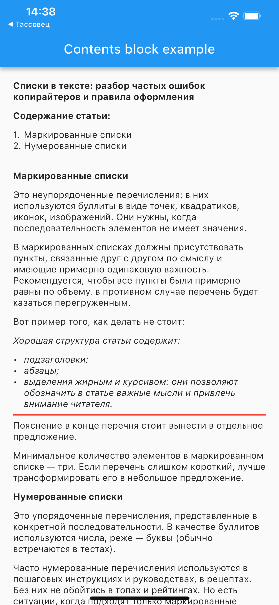

# content_block_parser_example

Demonstrates how to use the content_block_parser plugin.

## Getting Started



### Register widgets for content blocks

```dart
WidgetCreatorVisitor.registerBlocWidget(  
  'ordered_list / list_item',
  (p0, p1) => ListItemWidget.ordered(
    ListItemBlock.fromContentBlock(p0),
    children: p1 ?? [],
  ),
);

WidgetCreatorVisitor.registerBlocWidget(
  'list_item',
  (p0, p1) => ListItemWidget.unordered(
    ListItemBlock.fromContentBlock(p0),
    children: p1 ?? [],
  ),
);

WidgetCreatorVisitor.registerBlocWidget(
  'unordered_list',
  (p0, p1) => ListWidget(p0 as BlockContainer, children: p1 ?? []),
);

WidgetCreatorVisitor.registerBlocWidget(
  'main_container',
  (p0, p1) => DocumentWidget(p0 as BlockContainer, children: p1 ?? []),
);
```

### Use content blocks

```dart
final _creator = WidgetCreatorVisitor();
final _blocks = ContentBlock.fromJson(jsonContentBlocks)
  ..accept(_creator);

final widgets = _creator.get();
```

